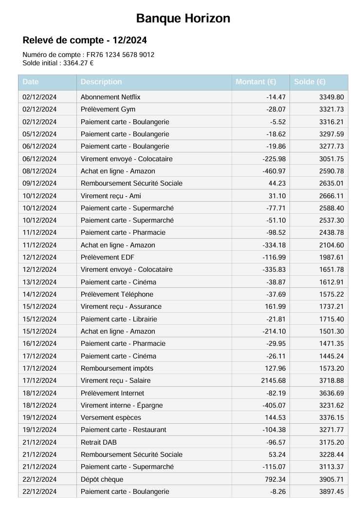
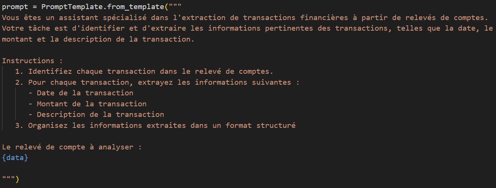
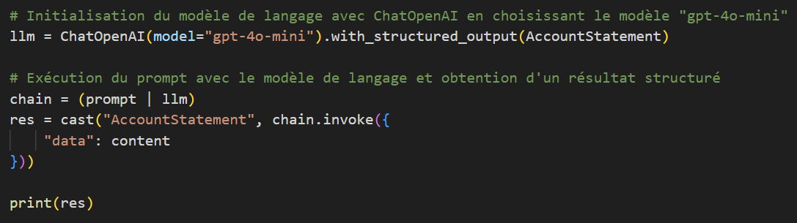
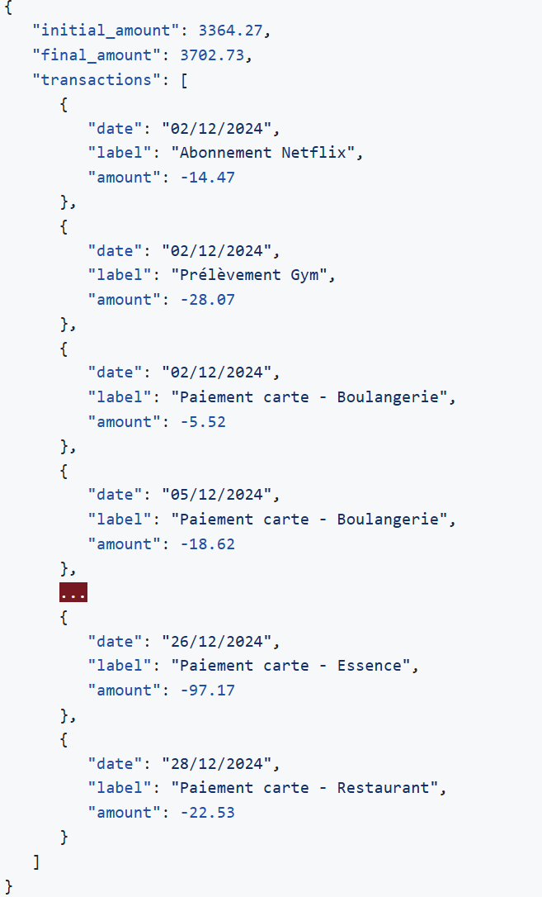
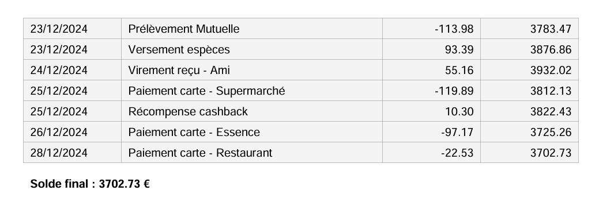
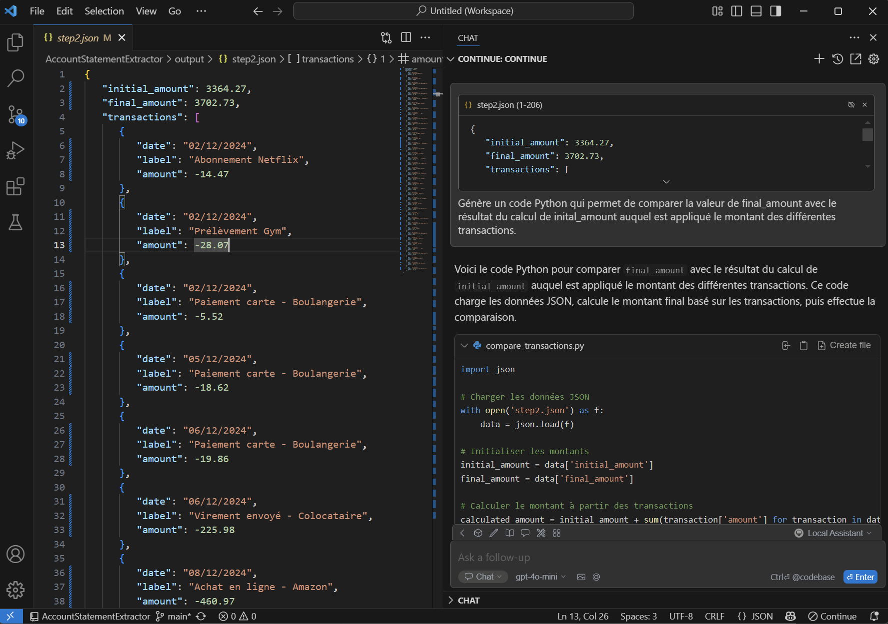
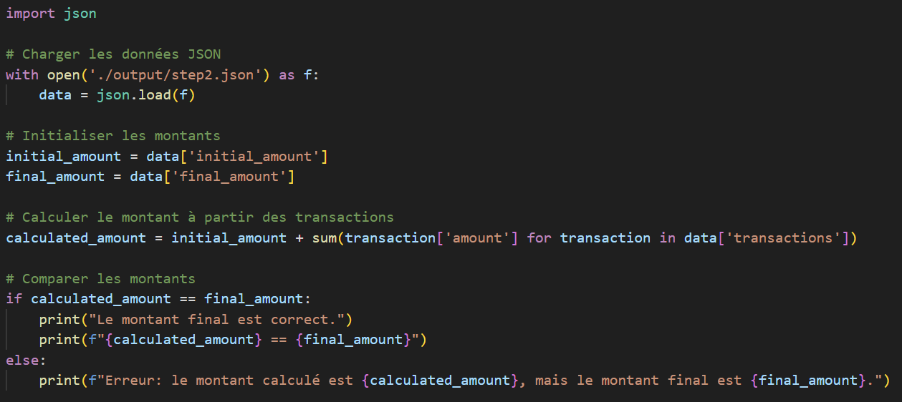
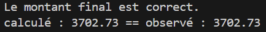
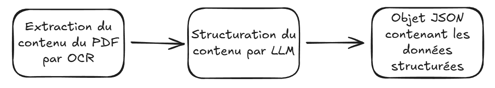

# Extraction de données depuis des PDF avec de l'IA générative

Dans un [article précédent](https://www.linkedin.com/pulse/lia-gen-pour-g%25C3%25A9n%25C3%25A9rer-des-donn%25C3%25A9es-de-test-pierre-mellet-nkile/), j'ai présenté la création de données d'exemple au format PDF avec de l'IA Gen.

J'envisage d'utiliser ces données pour développer de nouvelles capacités pour mon assistant personnel, afin qu'il puisse répondre à des questions et réaliser des analyses basées sur des documents PDF, tels que des relevés de comptes ou des factures de courses.

Dans cet article, je vais explorer comment tirer parti de l'IA générative pour extraire efficacement des données d'un PDF et les transformer afin de les rendre consommables par un assistant (spoiler : ce sera dans un autre article).

# Première étape : Extraction par OCR

La reconnaissance optique de caractères (OCR) est une technologie qui permet de convertir divers types de documents, tels que des photos de textes manuscrits ou imprimés, en données numériques exploitables. Elle repose sur des algorithmes d'apprentissage automatique et de traitement d'images pour identifier et extraire le texte présent dans les images.

Étant donné que cet article traite de l'IA générative, pourquoi ne pas l'exploiter pour créer un code intégrant un système d'OCR ?

Le prompt (j'ai honte) :

```
Genère un code python permettant d'extraire par OCR le contenu d'un PDF.
```

Voici le résultat :


```python

import PyPDF2
import pytesseract
from PIL import Image
import io
import os
 
# Chemin vers le fichier PDF
pdf_path = './input/releve_compte_01_2024_185.pdf'

# Chemin vers le fichier de sortie
output_path = './output/step1.txt'

# Créer le répertoire de sortie s'il n'existe pas
output_dir = os.path.dirname(output_path)
if not os.path.exists(output_dir):
    os.makedirs(output_dir)

# Ouvrir le fichier PDF
with open(pdf_path, 'rb') as file:
    pdf_reader = PyPDF2.PdfReader(file)

    # Parcourir chaque page du PDF
    for page_num in range(len(pdf_reader.pages)):
        page = pdf_reader.pages[page_num]

        # Extraire le texte de la page
        text = page.extract_text()

        # Si le texte extrait est vide, essayer d'effectuer l'OCR
        if not text:
            # Convertir la page en image
            page_image = page.to_image()

            # Sauvegarder l'image temporairement
            image_path = f'temp_page_{page_num}.png'
            page_image.save(image_path)

            # Effectuer l'OCR sur l'image
            text = pytesseract.image_to_string(Image.open(image_path))

            # Supprimer l'image temporaire
            os.remove(image_path)

        # Écrire le texte extrait dans le fichier de sortie
        with open(output_path, 'a', encoding='utf-8') as output_file:
            output_file.write(f'Page {page_num + 1}:\n')
            output_file.write(text)
            output_file.write('\n\n')

print(f'Le texte a été extrait et sauvegardé dans {output_path}')

```


En résumé, ce code utilise le framework OCR [Tesseract](https://github.com/tesseract-ocr/tesseract) pour extraire des informations d'un document PDF.

Examinons ce que cela donne si on applique ce code à un exemple de relevé de compte suivant :



L'application du code précédent, basé sur un OCR, permet d'extraire le contenu suivant :

```
Page 1:
Banque Horizon
 Relevé de compte - 12/2024
Numéro de compte : FR76 1234 5678 9012
Solde initial : 3364.27 €
Date
Description
Montant (€)
Solde (€)
02/12/2024
Abonnement Netflix
-14.47
3349.80
02/12/2024
Prélèvement Gym
-28.07
3321.73
02/12/2024
Paiement carte - Boulangerie
-5.52
3316.21
05/12/2024
Paiement carte - Boulangerie
-18.62
3297.59
06/12/2024
Paiement carte - Boulangerie
-19.86
3277.73
06/12/2024
Virement envoyé - Colocataire
-225.98
3051.75
08/12/2024
Achat en ligne - Amazon
-460.97
2590.78
09/12/2024
Remboursement Sécurité Sociale
44.23
2635.01
10/12/2024

...

```

C'est un bon début, car j'ai réussi à extraire des données ! Cependant, je constate que certaines informations clés liées à la structure du tableau d'origine contenant les transactions ont été perdues (nom des colonnes).

Pour fournir un contexte adéquat à un agent conversationnel, ces informations supplémentaires seront indispensables !


# Seconde étape : l'IA Gen pour restructurer les données

Après la première étape, j'ai réussi à extraire du contenu d'un PDF sous forme de texte, mais les données restent encore désorganisées.

Certains modèles de langage (LLM) permettent de piloter la structure des données générées en sortie. Plutôt que d'obtenir un texte en langage naturel, il est possible de demander une génération au format JSON et selon un [JSON Schema](https://json-schema.org/).

Voyons comment nous pouvons utiliser cette fonctionnalité pour organiser les données extraites lors de l'étape d'OCR. Pour ce faire, nous allons utiliser le framework Langchain, qui facilite l'interaction avec les LLM.

Avant de commencer l'extraction des données, il est crucial de définir le JSON Schema qui permettra au LLM d'identifier les informations à extraire et de les structurer correctement. Avec Langchain, cela se réalise en modélisant des classes Python.

Pour répondre à mon besoin, je souhaite extraire une liste de transactions. Pour ce faire, j'ai besoin de deux classes : la première pour représenter l'ensemble des transactions et des soldes, et la seconde pour décrire chaque transaction individuelle.


```python

class Transaction(BaseModel):
    """
    Représente une transaction dans un relevé de compte.

    Attributes:
        date (str): La date à laquelle la transaction a eu lieu.
        label (str): Une description ou un identifiant de la transaction.
        amount (float): Le montant de la transaction.
    """
    date: str = Field(description="Date de la transaction")
    label: str = Field(description="Label de la transaction")
    amount: float = Field(description="Montant de la transaction")

class AccountStatement(BaseModel):
    """
    Modélise un relevé de compte contenant des informations financières.

    Attributes:
        initial_amount (float): Montant initial sur le relevé de compte.
        final_amount (float): Montant final sur le relevé de compte après toutes les transactions.
        transactions (list[Transaction]): Liste des transactions associées à ce relevé de compte.
    """
    initial_amount: float = Field(description="Montant initial")
    final_amount: float = Field(description="Montant final")
    transactions: list[Transaction] = Field(description="Liste des transactions")  # Liste des transactions
    
```

Il est important de souligner que les attributs de ces deux classes sont initialisés à l'aide d'une instance de la classe Pydantic Field, qui permet de spécifier en langage naturel le rôle de chaque champ. Le LLM tirera parti de ces informations lors de la génération pour identifier la nature des données à produire pour chaque attribut.

C'est ici que l'abstraction offerte par Langchain permet un gain de temps considérable ! 

Pour appeler un LLM tout en lui spécifiant les règles sur la structuration des réponses, cela s'exprime en quelques lignes simples à comprendre :

```python

llm = ChatOpenAI(model="gpt-4o-mini").with_structured_output(AccountStatement)

```

Je souhaite utiliser le modèle gpt-4o-mini avec un format de réponse qui respecte le modèle d'objet défini par la classe AccountStatement.

Tous les appels à llm retourneront une instance de AccountStatement, contenant les données extraites selon le prompt utilisé et les descriptions des attributs d'AccountStatement.

Il est donc temps d'aborder la question du prompt ! Il est important de noter qu'il ne s'agit pas d'un prompt "statique", mais d'un prompt dont une partie est variable et dépend des données contextuelles (dans ce cas, les données non formatées d'un relevé de compte extraites par OCR). On parle alors d'un template de prompt.





La classe **PromptTemplate** de Langchain est un outil qui permet de définir un modèle de prompt comportant des zones variables (comme {data}). L'utilisation d'un PromptTemplate, au lieu d'une simple chaîne de caractères pour représenter un prompt, garantit que toutes les variables attendues par le modèle sont correctement renseignées avant d'appeler le LLM. Cela permet d'éviter de laisser des espaces réservés non valorisés dans le prompt envoyé au LLM !

Avec Langchain, l'appel d'un LLM en utilisant un prompt ou un template de prompt est très simple : il suffit d'enchaîner un **prompt** avec un **llm**.



 
Et voilà, la magie opère ! Les données sont désormais correctement organisées et enregistrées dans un fichier JSON, prêtes à être exploitées dans le futur !



# Vérification

Et si nous vérifiions tout cela ? Après tout, il s'agit de contenu généré qui peut être sujet à des biais ou à des hallucinations.

Je pourrais m'amuser à comparer chaque ligne du relevé de compte avec celui du JSON produit pour m'assurer que tout est correct, mais ce ne serait pas très passionnant à faire !

Sur le relevé de compte, j'ai le solde initial et le solde final, ces informations sont aussi extraites dans le JSON produit.

Je peux me baser sur ces informations pour vérifier que le résultat de l'opération consistant à appliquer les différents crédits et débits au solde initial me donne bien le solde final.



Demandons à l'IA générative de créer un code Python qui va recalculer le solde final à partir du fichier des transactions du fichier JSON des transactions que nous avons produit précédemment. Pour ce faire, j'utilise un plugin de mon IDE (environnement de développement) appelé Continue. Ce plugin me permet d'analyser des fichiers dans mon IDE et de générer du code selon mes instructions.

Utilisons continue pour lui demande de générer un code de verification du fichier JSON.
Le code devra prendre en entré le fichier JSON.



Le code produit :




Lorsque j'exécute ce code, j'obtiens un résultat qui correspond au solde indiqué sur le relevé PDF. 
Cela me permet de conclure que l'extraction et la structuration des données se sont probablement bien déroulées.



Bien que ce ne soit pas le test le plus fiable qui soit, on peut dire qu'un faux positif indiquerait une hallucination du LLM lors de l'extraction et de la restructuration des transactions au format JSON, entraînant quand même une équation : solde initial + transactions = solde final. Cela reste peu probable, surtout au regard de mon cas d'usage, qui n'est pas critique.

# Conclusion




L'extraction et la structuration des données à partir de fichiers PDF grâce à un OCR et à l'IA générative représentent une avancée significative pour automatiser le processus d'extraction d'informations des documents.

Dans cet exemple, j'ai montré comment cette méthode peut être utilisée pour extraire des données d'un PDF et les organiser au format JSON. Ce format facilite la manipulation des données, notamment pour les charger ultérieurement dans une base de données. De plus, cette approche peut également être appliquée à d'autres types de fichiers, tels que des pages HTML, des documents texte ou même du Markdown.

Nous pourrions aller plus loin en utilisant l'intelligence artificielle pour enrichir les données extraites. Par exemple, nous pourrions catégoriser les transactions, comme "alimentation" pour les achats dans un supermarché.

Cependant, il est crucial de considérer que cette combinaison d'OCR et d'IA générative doit être comparée à des solutions d'OCR plus avancées, capables d'effectuer directement une restructuration des données. Toutefois, cela peut impliquer une plus grande complexité et des coûts d'utilisation plus élevés.

En résumé, l'utilisation de l'IA générative pour extraire et structurer des données est une démarche simple et rapide qui facilite l'analyse et l'exploitation des informations présentes dans divers documents.
